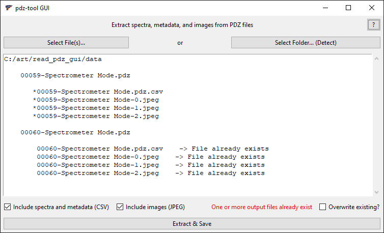

# pdz-tool-gui


User interface for [`pdz-tool`](https://github.com/bducraux/pdz-tool) which converts Bruker XRF spectral data PDZ files to open CSV and JPEG formats.



`pdz-tool` by [Bruno Ducraux](https://github.com/bducraux)
with features and fixes by [Lars Maxfield](https://github.com/larsmaxfield)

Interface created by [Lars Maxfield](https://github.com/larsmaxfield)

Image extraction adapted from `read_pdz` by [Frank Ligterink](https://github.com/fligt)

Icon by Good Stuff Non Sense, [CC BY 4.0](https://creativecommons.org/licenses/by/4.0/)


## Developers

### Dependencies

 - `pdz-tool`
 - `python>=3.11`
 - `tk`
 - `pyinstaller<6` if you need to create executables or packages ([`6.y.z` versions of `pyinstaller` can throw a error when closing the window on Windows](https://stackoverflow.com/questions/60502431/files-built-using-pyinstaller-onefile-no-longer-deletes-their-temporary-mei-d))


### Virtual environments

#### `conda`

If you use `conda` (Anaconda), it can be faster to manually create the environment instead of solving from `environment.yml`.

Change directory to the repo root and run these commands to manually create the environment in `./env`:

````
conda create -y --prefix ./env python=3.11 --force
conda activate ./env
pip install pdz-tool
pip install "pyinstaller<6"
````

To activate the environment in the future, change directory to repo root and run `conda activate ./env`. 


### Creating portable executable and package

Run PyInstaller with the following arguments while in the source code directory.

For Windows:

```
pyinstaller --onefile --windowed --icon=icon.ico --add-data=C:\absolute\path\to\source\icon.ico;. main.py
```

For macOS:

```
pyinstaller --windowed --icon=icon.icns --add-data=\absolute\path\to\source\icon.icns;. main.py
```

The terminating `;.` in the `add-data` path is necessary.
`.` indicates the directory in which to add the data, here root.
If the icons are moved to a subdirectory, this `.` will need to be replaced by
that subdirectory path.
