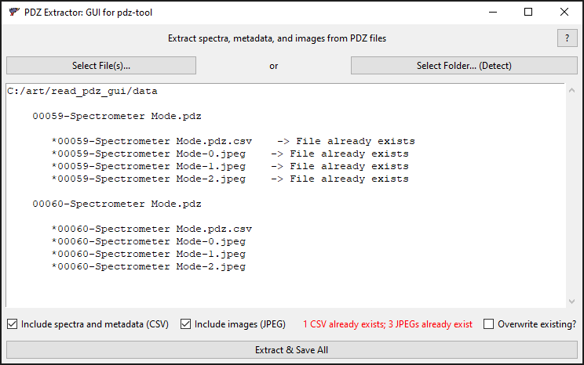

# PDZ Extractor: GUI for `pdz-tool`


User interface for [`pdz-tool`](https://github.com/bducraux/pdz-tool) which converts Bruker XRF* spectral data PDZ files to open CSV and JPEG formats.

*Tested on PDZ files from Bruker Tracer 5i Handheld XRF.




## Download and run

You can download and run PDZ Extractor as a [Windows executable](#windows-executable) or directly with [Python](#developers).

### Windows executable

For Windows, PDZ Extractor is available as a portable executable that runs directly by double-clicking or running from the command prompt. No installation is required.

Here's how:

1. [Download the latest Windows version](https://github.com/olive-groves/pdz-extractor/releases/latest) under `pdz-extractor_vx.y.z_win64_portable.exe.zip`

2. Extract `pdz-extractor_vx.y.z_win64_portable.exe` from the ZIP.
   
3. Double-click the extracted `pdz-extractor_vx.y.z_win64_portable.exe`.

4. **Wait up to 30 seconds** for PDZ Extractor to open.

> [!NOTE]
> Windows Defender SmartScreen might block you from running the executable via double-click:
>
> 
> 
> - If you have admin privileges, try [Option 1](#run-option-1-with-admin-privileges).
> - If you have no admin privileges, try [Option 2](#run-option-2-without-admin-privileges).
>
> *Why is it unrecognized and blocked?  In short, it’s because this executable has no certificate. If an executable's certificate isn't found by Windows when double-clicked, Windows will block it from immediately running.*

#### Run option 1: With admin privileges

If you have admin privileges:

1. Double-click on `pdz-extractor_vx.y.z_win64_portable.exe`.
2. On the Windows Defender SmartScreen pop-up, select **More info**.
3. Select **Run anyway**. _No **Run anyway**? Select **Don't run** and [try Option 2.](#run-option-2-without-admin-privileges)_
4. Wait for PDZ Extractor to open. This may take a few seconds.

#### Run option 2: Without admin privileges

If double-clicking the executable doesn’t work, try running it via the command prompt.

>*Not possible? You can try running on a virtual machine or contacting your machine admin.*

You can find various ways online on how to run an executable via the command prompt, but I prefer these steps:

1. Copy the path of the executable:
   - **Right-click** the file. (On Windows 10, press and hold the `Shift` key and then **right-click** the file.)
   - Select **Copy as path**.

2. Open the Start menu  (`⊞ Win`).
3. Type **cmd**.
4. Press the `Enter` key or select the Command Prompt app.
5. Paste into the prompt the executable path you copied with `Ctrl·V`.
6. Run by pressing `Enter`. 
7. Wait for the executable to load. This may take a few seconds.


### macOS app

For macOS, there is currently no app file available for PDZ Extractor.


## Developers

PDZ Extractor runs on Python 3.11 with just a couple [dependencies](#dependencies).

### Dependencies

 - `pdz-tool`
 - `python>=3.11`
 - `tk`
 - `pyinstaller<6` if you need to create executables or packages ([`6.y.z` versions of `pyinstaller` can throw a error when closing the window on Windows](https://stackoverflow.com/questions/60502431/files-built-using-pyinstaller-onefile-no-longer-deletes-their-temporary-mei-d))


### Virtual environments

#### `conda`

If you use `conda` (Anaconda), it can be faster to manually create the environment instead of solving from `environment.yml`.

Change directory to the repo root and run these commands to manually create the environment in `./env`:

````
conda create -y --prefix ./env python=3.11 --force
conda activate ./env
pip install pdz-tool
pip install "pyinstaller<6"
````

To activate the environment in the future, change directory to repo root and run `conda activate ./env`. 


### Creating portable executable and package

Run PyInstaller with the following arguments while in the source code directory.

For Windows:

```
pyinstaller --onefile --windowed --icon=icon.ico --add-data=C:\absolute\path\to\source\icon.ico;. main.py
```

For macOS:

```
pyinstaller --windowed --icon=icon.icns --add-data=\absolute\path\to\source\icon.icns;. main.py
```

The terminating `;.` in the `add-data` path is necessary. The period
`.` indicates the directory in which to add the data, here root.
If the icons are moved to a subdirectory, this `.` will need to be replaced by
that subdirectory path.

## Credits

`pdz-tool` by [Bruno Ducraux](https://github.com/bducraux)
with extended features and fixes by [Lars Maxfield](https://github.com/larsmaxfield)

User interface created by [Lars Maxfield](https://github.com/larsmaxfield)

Image extraction adapted from `read_pdz` by [Frank Ligterink](https://github.com/fligt)

Icon by Good Stuff Non Sense, [CC BY 4.0](https://creativecommons.org/licenses/by/4.0/)
